# Database schema

PostgreSQL 16 (Supabase). Everything is created by the ordered migrations in
`supabase/migrations/`; this document describes the result. Types for the
application are generated from the live schema (`npm run db:types`).

| Migration | Contents |
|---|---|
| `0001_foundation` | lookups, org units, positions, plantilla, settings, holidays, numbering |
| `0002_identity_employees` | permissions/roles, employees, private data, addresses, profiles, access helpers, `hr_save_employee` |
| `0003_audit` | `audit_logs`, audit trigger, `log_event`, `employee_change_history` |
| `0004_pds_service_records` | PDS sections, certification, service records |
| `0005_documents` | document categories, documents, immutable versions, upload functions |
| `0006_workflow_transactions` | workflow definitions, leave, attendance, HR requests, engine |
| `0007_notifications_imports` | notifications, outbox, import staging, `commit_employee_import` |
| `0008_reporting` | completion score, search, dashboards, data quality, reports |
| `0009_rls_grants_admin` | privileges, RLS policies, storage policies, admin functions |
| `0010_reference_data` | permissions, roles, lookups, default workflows, settings (**editable defaults, not policy**) |
| `0011_audit_triggers` | attaches the audit trigger to master/transaction tables |

## Entity-relationship overview

```mermaid
erDiagram
  auth_users ||--o| profiles : "identity"
  profiles }o--o| employees : "linked to"
  profiles ||--o{ user_roles : has
  roles ||--o{ user_roles : grants
  roles ||--o{ role_permissions : has
  permissions ||--o{ role_permissions : in
  org_units ||--o{ org_units : "parent"
  org_unit_types ||--o{ org_units : typed
  employees }o--o| org_units : "assigned to"
  employees }o--o| positions : holds
  employees }o--o| plantilla_items : "occupies"
  plantilla_items }o--|| positions : for
  plantilla_items }o--|| org_units : in
  employees }o--o| employment_statuses : status
  employees }o--o| employees : "supervised by"
  employees ||--o| employee_private : "sensitive data"
  employees ||--o{ employee_addresses : has
  employees ||--o{ employee_family : pds
  employees ||--o{ employee_education : pds
  employees ||--o{ employee_eligibility : pds
  employees ||--o{ employee_work_experience : pds
  employees ||--o{ employee_voluntary_work : pds
  employees ||--o{ employee_training : pds
  employees ||--o{ employee_other_info : pds
  employees ||--o{ employee_references : pds
  employees ||--o{ employee_gov_ids : pds
  employees ||--o{ pds_declaration_answers : pds
  employees ||--o{ pds_submissions : "certify / verify"
  employees ||--o{ service_records : history
  employees ||--o{ documents : folder
  documents ||--o{ document_versions : versions
  document_categories ||--o{ documents : categorizes
  employees ||--o{ attendance_records : DTR
  employees ||--o{ attendance_corrections : requests
  employees ||--o{ leave_applications : requests
  employees ||--o{ leave_balances : balances
  employees ||--o{ hr_requests : requests
  hr_request_types ||--o{ hr_requests : typed
  leave_types ||--o{ leave_applications : typed
  workflows ||--o{ workflow_steps : steps
  leave_applications }o--|| workflows : follows
  attendance_corrections }o--|| workflows : follows
  hr_requests }o--|| workflows : follows
  profiles ||--o{ notifications : receives
  notifications ||--o{ notification_outbox : channels
  import_batches ||--o{ import_rows : rows
```

(`workflow_actions` and `audit_logs` reference records by `entity_type` +
`entity_id` rather than foreign keys, so history survives any later change.)

## Master data

| Table | Purpose | Notes |
|---|---|---|
| `org_unit_types` | Levels used by the structure (regional office, office, division, section, unit, service center) | Admin-editable |
| `org_units` | The organization tree: `parent_id`, `unit_type`, `head_employee_id` | Cycle-proof (trigger). Heads get supervisory access to their whole subtree |
| `positions` | Position titles, standard salary grade (1–33) | |
| `plantilla_items` | Item number → position + unit | One **active** incumbent per item (partial unique index) |
| `employment_statuses`, `appointment_natures` | Configurable vocabularies | Not assumed to be exhaustive |
| `attendance_statuses` | DTR statuses; `counts_as_present` | `PRESENT`, `LATE`, `UNDERTIME`, `MISSING_LOG`, `ABSENT`, `LEAVE` are referenced by logic |
| `leave_types` | Name, `requires_balance`, `deducts_balance`, optional `accrual_rule` JSON | **No entitlement is inferred.** Rules are what you configure |
| `document_categories` | Folder categories; `is_required`, `requires_expiry` | `is_required` feeds compliance reports and data quality |
| `hr_request_types` | Services; `requires_attachment`, `produces_document`, optional `workflow_code` | |
| `pds_declaration_questions` | PDS declaration items (wording maintained by HR) | Validate against the current CSC form |
| `holidays` | Excluded from leave-day counting; shown in the DTR | **No list is seeded** |
| `system_settings` | Non-secret configuration (JSON values) | Upload limits, channels, audit options, privacy version |
| `number_counters` | `HR-2026-000123`-style numbers, per prefix and year (Manila time) | Not user-accessible |

### Employees

`employees` — organizational/employment information visible to the employee, HR
and supervisors:

`employee_no` (unique, default `EMP-000001` sequence), `prc_employee_no`, names,
`sex`, `official_email`, `position_id`, `plantilla_item_id`, `position_number`,
`salary_grade`, `salary_step`, `employment_status_code`,
`appointment_nature_code`, original/current appointment dates, `date_assumed`,
`org_unit_id`, `supervisor_employee_id`, `record_status`
(`active`/`inactive`/`separated`), `separation_date`.

`employee_private` — visible only to the employee and holders of
`employee.read_sensitive`: birth date/place, civil status, citizenship, blood
type, **TIN, GSIS BP, PhilHealth, Pag-IBIG** (each unique across the workforce;
format check is deliberately loose, 9–15 digits, pending agency-confirmed
formats), personal email, mobile.

`employee_addresses` — residential / permanent address (restricted like private data).

`profiles` — links `auth.users` to an `employees` row; `is_active`; privacy
acknowledgement and notice version.

Views: `employee_directory` (joined names, division; **security invoker**, so RLS
decides which rows a user gets), `org_unit_ancestry`, `current_service_record`,
`leave_balance_summary` (pending + available).

### Personal Data Sheet (normalized)

One table per section instead of one JSON document: `employee_family`,
`employee_education`, `employee_eligibility`, `employee_work_experience`,
`employee_voluntary_work`, `employee_training`, `employee_other_info`,
`employee_references` (max 3, trigger), `employee_gov_ids`,
`pds_declaration_answers` (keyed by configurable question), and
`pds_submissions` (append-only *certified / verified / returned* history).
Personal information (section 1) comes from `employees` + `employee_private`.

### Service record

`service_records`: `date_from`, `date_to` (null = current), `record_type`,
position, appointment status, office, station, salary, SG/step, LWOP days,
separation cause, remarks, optional `document_id`. An **exclusion constraint**
makes overlapping periods for one employee impossible; the open-ended row is the
derived *current* record (`current_service_record`). A data-quality check flags
when it disagrees with the employee record.

## Transaction data

All three request types share: `request_no` (system-generated), `employee_id`
(the requester), `status` (`draft` → `in_review` → `approved` / `rejected` /
`cancelled` / `completed`), `workflow_code`, `current_step_order`,
`submitted_at`, `completed_at`.

* `leave_applications` — type, dates, `days` (defaults to working days; capped at the calendar span), reason.
  `leave_balances` — beginning / earned / used per employee, type, year.
* `attendance_records` — one per employee per day: time in/out, break, generated `total_minutes`, status, source (`manual`, `biometric`, `import`, `correction`).
  `attendance_corrections` — date, type, proposed times, reason; one open request per date/type.
* `hr_requests` — type, priority, subject, details, `assigned_to`, `result_document_id`.
* `documents` — metadata, status (`for_review`, `verified`, `rejected`, `archived`), expiry, soft-delete fields, optional link to the request it supports. `document_versions` — immutable: storage path, file name, MIME, size, **SHA-256**, uploader, reason.
* `import_batches` / `import_rows` — staged spreadsheet imports (raw → normalized + errors); nothing reaches master data until confirmed.
* `notifications` (personal) and `notification_outbox` (non-in-app channels, service-role only).

### Workflow definitions

`workflows` (entity type, default flag) and `workflow_steps` (order, label shown
while pending, `actor_kind` = *supervisor* or *permission*, required permission,
status after approval). Edited in Administration → Workflows.

## Audit data

* `audit_logs` — `occurred_at`, actor (id + name snapshot), `action`, `module`, entity type/id, `subject_employee_id`, `old_values`, `new_values`, `reason`, `metadata`. Immutable.
* `workflow_actions` — the request timeline: step, action, actor name snapshot, remarks, status change. Immutable.

## Access control in the schema

* RLS is **enabled on every table**; policies are in `0009_rls_grants_admin.sql`.
  Reference data: readable by any signed-in user, writable by the matching admin permission.
  Employees: self, supervisors of their subtree, or `employee.read_all`.
  Private data / addresses: self or `employee.read_sensitive`.
  PDS: self or `pds.read_all`; edited by self or `pds.write_any`.
  Service records: self or `service_record.read_all` (supervisors **cannot** see salary history).
  Documents: via `can_read_document()` (owner, `document.read_all`, or supervisor/HR of a request the file supports).
  Requests: requester, supervisors of the requester, or the matching `*.read_all`; the requester edits only drafts.
  Audit: `audit.read` only. Notifications: owner only.
* Table privileges for `anon`/`authenticated` are revoked and re-granted
  narrowly; **writes with business meaning have no direct grant** (employees,
  documents, versions, roles, audit, workflow history) and go through functions.
* Functions callable by signed-in users are listed explicitly; internal helpers
  (`notify`, `next_number`, `wf_log`, …) are not executable by end users.

## Key functions

| Area | Functions |
|---|---|
| Access | `my_access`, `has_permission`, `has_role`, `current_employee_id`, `is_self`, `supervises`, `can_read_employee/document/request` |
| Employees | `hr_save_employee` (permissions, protected fields, mandatory reason), `update_my_contact`, `acknowledge_privacy`, `employee_change_history`, `profile_completion`, `search_employees` |
| PDS | `pds_certify`, `pds_review` |
| Documents | `create_document`, `add_document_version`, `update_document_details`, `set_document_status`, `delete_document` |
| Workflow | `wf_submit`, `wf_act` (approve/reject/return/cancel), `wf_comment`, `hr_request_assign`, `hr_request_attach_result`, `my_pending_actions` |
| Reporting | `dashboard_hr`, `dashboard_executive`, `data_quality_report`, `report_*` |
| Import | `commit_employee_import` |
| Admin | `admin_provision_user`, `admin_set_user_roles`, `admin_set_user_active`, `admin_save_role` (privilege-escalation and lock-out safeguards) |
| Audit | `log_event` (allow-listed), audit triggers |

## Validation implemented in the database

Duplicate employee IDs and government identifiers; invalid email/phone/ID
formats; impossible dates (appointment before original, separation before
appointment, end before start); overlapping service periods; salary
grade/step ranges; one active incumbent per plantilla item; max three PDS
references; leave days cannot exceed the calendar span; no overlapping leave
applications; leave beyond the available balance (when the type requires a
balance); one open attendance correction per date/type.

Cross-record checks that are *warnings, not hard failures* (legacy data is
messy) are in `data_quality_report()`: missing required fields, probable
duplicate persons (same name + birth date), assumption before appointment,
appointment before age 18, status/date conflicts, no service record, service
record ≠ employee record, plantilla/unit/position inconsistencies, inactive
supervisor, missing/expired required documents, identical files stored twice.

## Assumptions

* Government ID formats are loosely validated (9–15 digits). Replace with
  agency-confirmed patterns.
* Salary grade range 1–33 and step 1–8 follow common government practice;
  adjust the CHECK constraints if the agency's schedule differs.
* Seeded lookups, workflows, permissions and role mappings are **starting
  points for configuration**, not statements of PRC/CSC policy.
